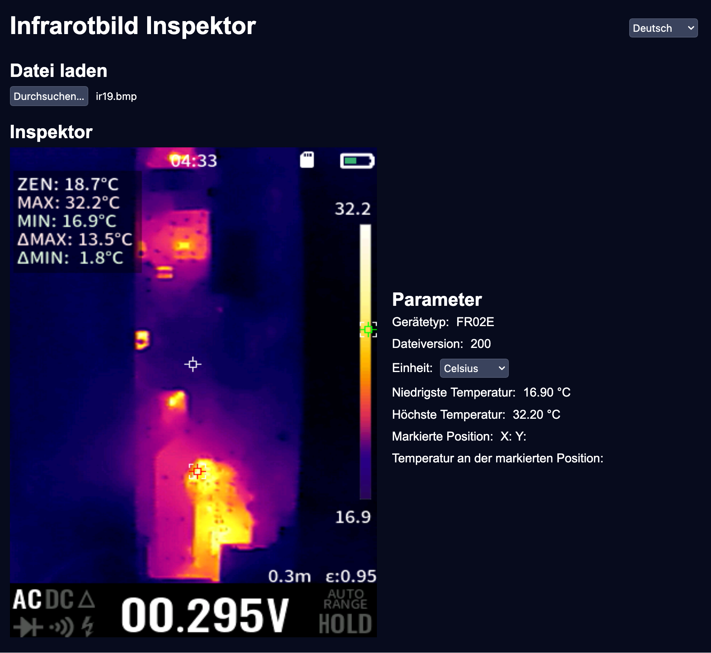
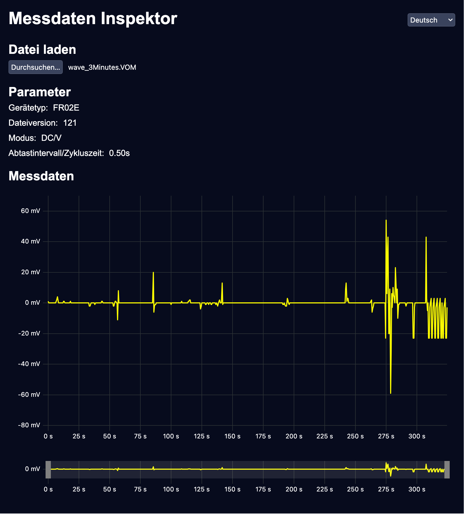

# InspectM
Inspect measurement data from [TOOLTOP thermal imaging cameras](https://tooltop.pro/de/thermal-imagers).

## How to Use

### Get Temperature Information
1. Open a BMP file from a Tooltop infrared camera or Multitool.
2. Click on the image to get temperature information.

### Change Unit
1. Click on the unit dropdown.
2. Choose your preferred unit.  
   Currently, Celsius, Kelvin, and Fahrenheit are supported.

### Change Language
1. Click on the language dropdown.
2. Choose your preferred language.  
   Currently, German, English, and simplified Chinese are supported.

## Sample

## Supported Platforms
**Desktop-/Mobile-Application** available on:
 - Windows
 - macOS
 - Linux
 - Android (coming soon)
 - iOS (coming soon)

Also available as a **self-hosted/local web application** or as a **Progressive Web App (PWA)** on all browsers that support PWAs, across all platforms.

## Downloads/Hosting
WebApp:
 https://eifelectric.github.io/InspectM/IR
 https://eifelectric.github.io/InspectM/DMM

Binaries:
 https://github.com/eifELectric/InspectM/releases